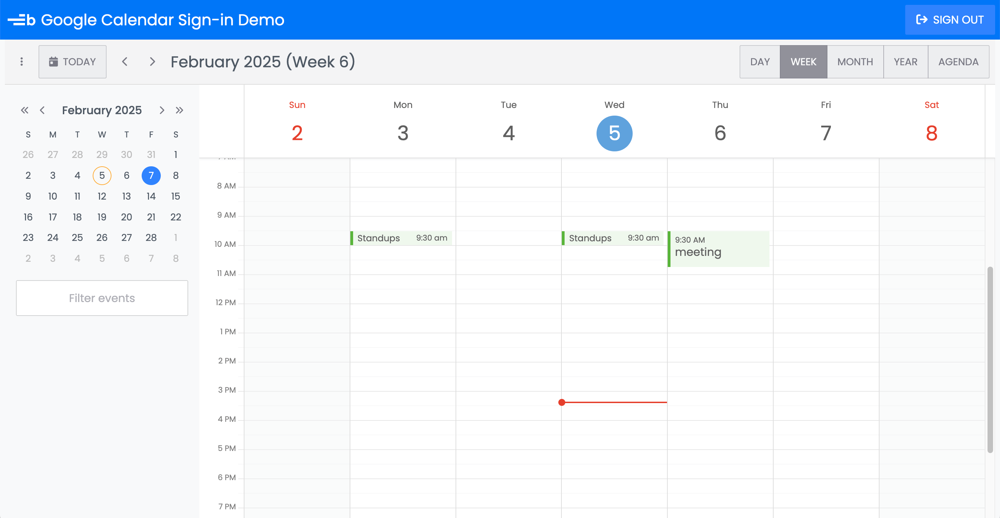

# Syncing Google Calendar and Bryntum Calendar Demo

This is the repository for the project hosted at https://google-calendar-demo.bryntum.com. 

It lets see people open a basic app showing a Bryntum Calendar with real events from their Google Calendar.

## Build and deploy (Quickstart)

Install the dependencies by running the following command: 

```sh
npm install
```

## Adding your Google Project Client ID to an environmental variable

Create an `.env` file in the root folder and save your Google project's OAuth **Client ID** as an environmental variable called `VITE_GOOGLE_CLIENT_ID`:

```
VITE_GOOGLE_CLIENT_ID=<your-client-id>
```

Run 

```
npm run build
```

This puts the full application into the `dist` folder. It's a front-end only application so it can be hosted anywhere easily.


## Installing the Bryntum Calendar React component

If you're not set up with Bryntum calendar, you might need to do this first before the above will work.

First, follow the [guide to accessing the Bryntum npm repository](https://bryntum.com/products/calendar/docs/guide/Calendar/npm-repository). Once you’ve logged in to the registry, install the Bryntum Calendar packages.

- If you’re using the trial version, use the following command:

  ```sh
  npm install @bryntum/calendar@npm:@bryntum/calendar-trial @bryntum/calendar-react
  ```

- If you’re using the licensed version, use the following command:

  ```sh
  npm install @bryntum/calendar @bryntum/calendar-react
  ```

## Running the app

If you want to test the app locally before deploying, you can do it like this.

Run the local dev server using the following command:

```sh
npm run dev
```

Open http://localhost:5173, and login using your Google account. You'll see your Google calendar events displayed in the Bryntum Calendar:


